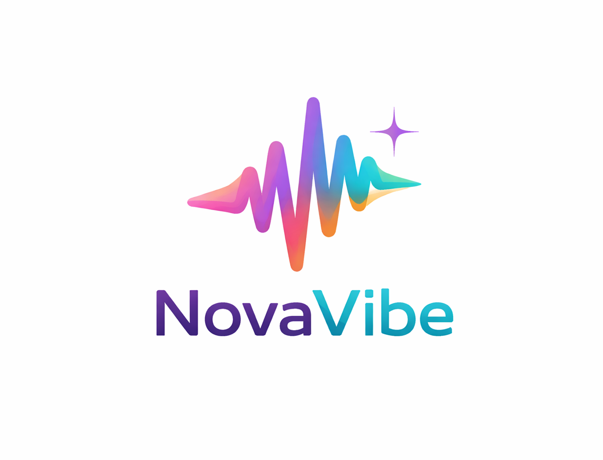

# 🚀 NovaVibe – Emotion-Based Music Recommendation System

NovaVibe is an AI-powered full-stack web application that detects real-time facial expressions and recommends music based on your current mood.
It combines **computer vision** with a **MERN stack architecture** to create a personalized and interactive music experience.


---

## 🎯 Tagline

**"Feel the music. Live the vibe."**

---

## 🚀 Live Demo

👉 Add your deployed link here (Vercel / Netlify)

---

## 🧠 How It Works

1. 📷 Captures your face using webcam
2. 🤖 Uses MediaPipe to detect facial landmarks
3. 🎭 Classifies emotion (Happy, Sad, Surprise, Neutral)
4. 🎵 Recommends music based on detected mood

---

## ✨ Features

### 🎯 AI Mood Detection

* Real-time facial expression recognition
* Uses MediaPipe Face Landmarker
* Processes 50+ facial blendshapes

### 🎵 Smart Music Recommendation

* Suggests songs based on mood
* Dynamic emotion → playlist mapping

### 🔐 Authentication System

* JWT-based login & registration
* Secure user sessions

### 👤 Guest Mode

* Try the app without login
* Limited session access

### 📤 Song Upload System

* Upload your own songs
* Tag songs with emotions
* Expand recommendation system

### 🎨 UI/UX

* Modern responsive design
* Smooth animations using GSAP / Framer Motion
* Clean and interactive interface

---

## 🛠️ Tech Stack

| Layer     | Technology           |
| --------- | -------------------- |
| Frontend  | React.js (Vite)      |
| Backend   | Node.js, Express.js  |
| Database  | MongoDB              |
| AI/ML     | Google MediaPipe     |
| Animation | GSAP / Framer Motion |
| Auth      | JWT                  |

---

## ⚙️ Emotion Detection Logic

* 😊 **Happy** → mouthSmileLeft + mouthSmileRight
* 😲 **Surprise** → eyeWide + browInnerUp
* 😢 **Sad** → mouthFrown + frownLeft/right
* 😐 **Neutral** → baseline expression

---

## 📦 Installation

```bash
# Clone repository
git clone https://github.com/NasimReja077/novavibe-ai.git

# Navigate to project folder
cd novavibe-ai

# Install dependencies
npm install

# Run frontend
npm run dev
```

---

## 📁 Project Structure

```
client/
 ├── components/
 ├── pages/
 ├── hooks/
 └── utils/

server/
 ├── controllers/
 ├── routes/
 ├── models/
 └── middleware/
```

---

## 🚧 Future Improvements

* [ ] Spotify API integration
* [ ] Real-time music streaming
* [ ] Emotion history tracking
* [ ] AI model accuracy improvements
* [ ] Mobile optimization

---

## 🖼️ Preview

)

---

## 🤝 Contributing

Contributions are welcome!

```bash
git checkout -b feature/new-feature
git commit -m "Add new feature"
git push origin feature/new-feature
```

---

## 📜 License

MIT License

---

## 👨‍💻 Author

**Nasim Reja Mondal**

* GitHub: https://github.com/NasimReja077
* Portfolio: Add your link

---

## ⭐ Support

If you like this project, give it a ⭐ on GitHub!
